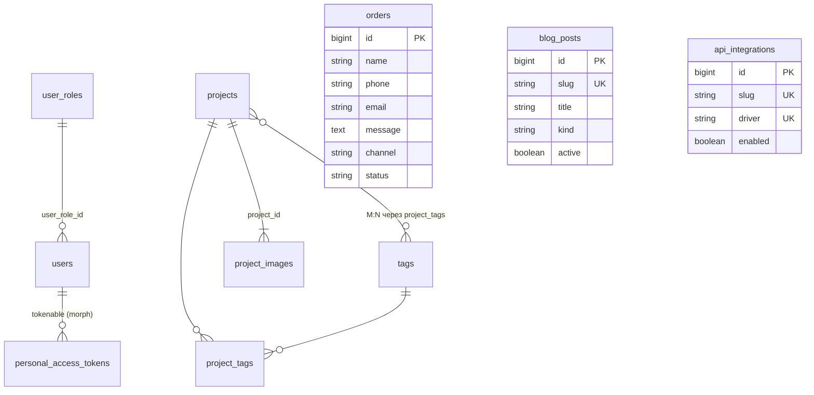
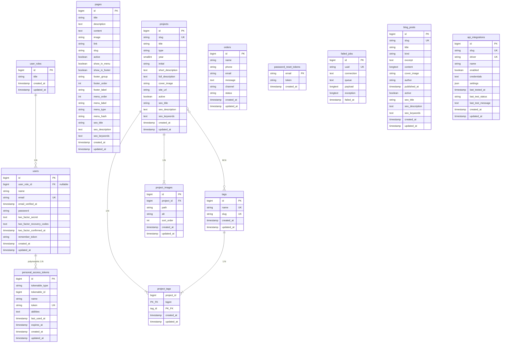

# База данных Nexora

Документация построена по миграциям в `database/migrations/` и связям Eloquent в `app/Models/`.

**СУБД:** MySQL 8.0 (Docker-сервис `db`)  
**Имя БД:** `nexora_db` (см. `nexora-app/.env`)

---

## Обзор доменов

| Домен | Таблицы | Назначение |
|-------|---------|------------|
| **Аутентификация и роли** | `users`, `user_roles`, `password_reset_tokens`, `personal_access_tokens` | Пользователи Nova/API, роли, 2FA, Sanctum |
| **Контент** | `pages`, `projects`, `tags`, `project_tags`, `project_images`, `blog_posts` | Страницы сайта, портфолио, теги, галереи, новости и статьи |
| **Заявки** | `orders` | Обратная связь / заказы (без FK на другие сущности) |
| **Интеграции** | `api_integrations` | Настройки внешних API |
| **Инфраструктура Laravel** | `failed_jobs` | Очередь неуспешных задач |

---

## ER-диаграмма (основная предметная область)



---

## ER-диаграмма (полная схема)



---

## Связи (кардинальность)

| От | К | Тип | FK / pivot | ON DELETE |
|----|---|-----|------------|-----------|
| `user_roles` | `users` | 1:N | `users.user_role_id` → `user_roles.id` | `SET NULL` |
| `projects` | `tags` | M:N | `project_tags` (`project_id`, `tag_id`) | `CASCADE` |
| `projects` | `project_images` | 1:N | `project_images.project_id` | `CASCADE` |
| `users` | `personal_access_tokens` | 1:N (polymorphic) | `tokenable_type`, `tokenable_id` | — (Laravel default) |
| `orders` | — | — | Изолированная таблица | — |

**Тег:** сущность `tags` используется для проектов через `project_tags`. Таблица `page_tags` удалена миграцией `2026_05_27_120000_drop_page_tags_table.php`.

---

## Таблицы (детально)

### `user_roles`

Роли пользователей (админка Nova).

| Колонка | Тип | Ограничения |
|---------|-----|-------------|
| `id` | `bigint` | PK, auto increment |
| `title` | `string` | — |
| `created_at`, `updated_at` | `timestamp` | — |

**Модель:** `App\Models\UserRole` → `hasMany(User)`

---

### `users`

Пользователи системы (Fortify / Nova / Sanctum).

| Колонка | Тип | Ограничения |
|---------|-----|-------------|
| `id` | `bigint` | PK |
| `name` | `string` | — |
| `email` | `string` | UNIQUE |
| `email_verified_at` | `timestamp` | nullable |
| `password` | `string` | — |
| `two_factor_secret` | `text` | nullable (Fortify) |
| `two_factor_recovery_codes` | `text` | nullable |
| `two_factor_confirmed_at` | `timestamp` | nullable |
| `user_role_id` | `bigint` | FK → `user_roles.id`, nullable |
| `remember_token` | `string` | nullable |
| `created_at`, `updated_at` | `timestamp` | — |

**Модель:** `App\Models\User` → `belongsTo(UserRole)`, `HasApiTokens`

---

### `pages`

CMS-страницы сайта.

| Колонка | Тип | Ограничения |
|---------|-----|-------------|
| `id` | `bigint` | PK |
| `title` | `string` | nullable |
| `description` | `text` | nullable |
| `content` | `text` | nullable |
| `image` | `string` | nullable |
| `link` | `string` | nullable |
| `slug` | `string` | UNIQUE, NOT NULL после миграции hardening |
| `active` | `boolean` | default `false`, **index** |
| `show_in_menu` | `boolean` | default `false` |
| `show_in_footer` | `boolean` | default `false` |
| `footer_group` | `string(50)` | nullable, CHECK `sections/services/legal` после миграции hardening |
| `footer_order` | `unsignedInteger` | default `0` |
| `footer_label` | `string` | nullable |
| `menu_order` | `unsignedInteger` | default `0` |
| `menu_label` | `string` | nullable |
| `menu_type` | `string` | default `route`, CHECK `route/anchor/external` после миграции hardening |
| `menu_hash` | `string` | nullable |
| `seo_title` | `string` | nullable |
| `seo_description` | `text` | nullable |
| `seo_keywords` | `text` | nullable |
| `created_at`, `updated_at` | `timestamp` | — |

**Модель:** `App\Models\Page`; route key: `slug`; связи с `Tags` нет.

---

### `tags`

Справочник тегов (категории портфолио / метки страниц).

| Колонка | Тип | Ограничения |
|---------|-----|-------------|
| `id` | `bigint` | PK |
| `name` | `string` | UNIQUE |
| `slug` | `string` | UNIQUE |
| `created_at`, `updated_at` | `timestamp` | — |

**Модель:** `App\Models\Tags` → `projects()` (M:N)

**Сидер:** `TagsSeeder` (данные из `App\Support\PortfolioData::tags()`)

---

### `projects`

Проекты портфолио.

| Колонка | Тип | Ограничения |
|---------|-----|-------------|
| `id` | `bigint` | PK |
| `slug` | `string` | UNIQUE (добавлено миграцией `2026_05_26_100000`) |
| `title` | `string` | nullable |
| `type` | `string` | nullable (тип сайта: «Корпоративный сайт» и т.д.) |
| `year` | `unsignedSmallInteger` | nullable |
| `initial` | `string(8)` | nullable (буква на превью) |
| `short_description` | `text` | nullable |
| `full_description` | `text` | nullable |
| `cover_image` | `string` | nullable |
| `site_url` | `string` | nullable |
| `active` | `boolean` | default `false`, **index** |
| `seo_title` | `string` | nullable |
| `seo_description` | `text` | nullable |
| `seo_keywords` | `text` | nullable |
| `created_at`, `updated_at` | `timestamp` | — |

**Модель:** `App\Models\Project` → `tags()`, `images()`; route key: `slug`

**Сидер:** `ProjectSeeder` (`PortfolioData::projects()`)

---

### `project_tags` (pivot)

| Колонка | Тип | Ограничения |
|---------|-----|-------------|
| `project_id` | `bigint` | PK, FK → `projects.id` CASCADE |
| `tag_id` | `bigint` | PK, FK → `tags.id` CASCADE |
| `created_at`, `updated_at` | `timestamp` | — |

**Модель pivot:** `App\Models\ProjectTag`

---

### `project_images`

Галерея скриншотов проекта.

| Колонка | Тип | Ограничения |
|---------|-----|-------------|
| `id` | `bigint` | PK |
| `project_id` | `bigint` | FK → `projects.id` CASCADE |
| `path` | `string` | — |
| `alt` | `string` | nullable |
| `sort_order` | `unsignedInteger` | default `0` |
| `created_at`, `updated_at` | `timestamp` | — |

**Индекс:** `(project_id, sort_order)`

**Модель:** `App\Models\ProjectImage` → `belongsTo(Project)`

---

### `orders`

Заявки с формы обратной связи.

| Колонка | Тип | Ограничения |
|---------|-----|-------------|
| `id` | `bigint` | PK |
| `name` | `string` | NOT NULL после миграции hardening |
| `phone` | `string` | NOT NULL после миграции hardening |
| `email` | `string` | NOT NULL после миграции hardening |
| `message` | `text` | nullable |
| `channel` | `string` | nullable, CHECK `email/phone/telegram/viber` после миграции hardening |
| `status` | `string` | default `'new'`, CHECK `new/in_progress/done/cancelled` после миграции hardening |
| `created_at`, `updated_at` | `timestamp` | — |

**Статусы (модель):** `new`, `in_progress`, `done`, `cancelled` — см. `Order::statuses()`

**Связей с другими таблицами нет.**

---

### `blog_posts`

Новости и статьи.

| Колонка | Тип | Ограничения |
|---------|-----|-------------|
| `id` | `bigint` | PK |
| `slug` | `string` | UNIQUE |
| `title` | `string` | NOT NULL |
| `kind` | `string(32)` | CHECK `news/article` после миграции hardening |
| `excerpt` | `text` | nullable |
| `content` | `longText` | nullable |
| `cover_image` | `string` | nullable |
| `author` | `string` | nullable |
| `published_at` | `timestamp` | nullable, index |
| `active` | `boolean` | default `false` |
| `seo_title` | `string` | nullable |
| `seo_description` | `text` | nullable |
| `seo_keywords` | `text` | nullable |
| `created_at`, `updated_at` | `timestamp` | — |

**Индексы:** `(kind, active)`, `published_at`, `(kind, active, published_at, id)` после миграции hardening.

**Модель:** `App\Models\BlogPost`; route key: `slug`.

---

### `api_integrations`

Настройки внешних API.

| Колонка | Тип | Ограничения |
|---------|-----|-------------|
| `id` | `bigint` | PK |
| `slug` | `string` | UNIQUE |
| `driver` | `string` | UNIQUE |
| `name` | `string` | — |
| `enabled` | `boolean` | default `false` |
| `credentials` | `text` | nullable, encrypted array cast в модели |
| `settings` | `json` | nullable |
| `last_tested_at` | `timestamp` | nullable |
| `last_test_status` | `string(32)` | nullable, CHECK `success/failed` после миграции hardening |
| `last_test_message` | `text` | nullable |
| `created_at`, `updated_at` | `timestamp` | — |

**Модель:** `App\Models\ApiIntegration`.

---

## Служебные таблицы Laravel

### `personal_access_tokens` (Sanctum)

| Колонка | Тип | Примечание |
|---------|-----|------------|
| `tokenable_type`, `tokenable_id` | morph | Обычно `App\Models\User` |
| `name`, `token`, `abilities` | — | API-токены |
| `last_used_at`, `expires_at` | `timestamp` | nullable |

### `password_reset_tokens`

| Колонка | Тип | Примечание |
|---------|-----|------------|
| `email` | `string` | PK (не FK на `users`) |
| `token` | `string` | — |
| `created_at` | `timestamp` | nullable |

### `failed_jobs`

Очередь: `uuid`, `connection`, `queue`, `payload`, `exception`, `failed_at`.

---

## Порядок миграций

```
2014_10_12_000000_create_users_table
2014_10_12_100000_create_password_reset_tokens_table
2014_10_12_200000_add_two_factor_columns_to_users_table
2019_08_19_000000_create_failed_jobs_table
2019_12_14_000001_create_personal_access_tokens_table
2026_05_19_090016_create_user_roles_table
2026_05_19_101500_add_user_role_id_to_users_table
2026_05_25_082128_create_pages_table
2026_05_25_084350_create_tags_table
2026_05_25_085047_create_projects_table
2026_05_25_085147_create_project_images_table
2026_05_25_085244_create_project_tags_table
2026_05_25_085533_create_orders_table
2026_05_26_100000_add_slug_to_projects_table
2026_05_27_100000_add_unique_index_to_pages_slug
2026_05_27_120000_add_channel_to_orders_table
2026_05_27_120000_drop_page_tags_table
2026_05_28_100000_add_menu_fields_to_pages_table
2026_05_29_100000_add_footer_fields_to_pages_table
2026_05_30_100000_create_api_integrations_table
2026_05_31_100000_create_blog_posts_table
2026_06_01_100000_harden_domain_constraints_and_indexes
```

---

## Сидеры

```
DatabaseSeeder
├── UserSeeder
├── ApiIntegrationSeeder
├── TagsSeeder      → tags
├── ProjectSeeder   → projects + project_tags
├── BlogPostSeeder  → blog_posts
├── PageSeeder      → pages
└── OrderSeeder     → orders
```

---

## Диаграмма зависимостей (текст)

```
user_roles
    └── users ──► personal_access_tokens (morph)

tags ◄──► projects   (project_tags)
projects ──► project_images

orders (standalone)
blog_posts (standalone)
api_integrations (standalone)

password_reset_tokens  (по email, без FK)
failed_jobs            (standalone)
```

---

## Замечания по схеме

1. **`tags` — общий справочник** для `pages` и `projects`; удаление тега каскадно убирает связи в pivot-таблицах.
2. **`projects.slug`** обязателен и уникален после миграции `2026_05_26`; сидер должен заполнять `slug` при создании записей.
3. **`pages.slug`** в миграции nullable и без UNIQUE — при необходимости стоит добавить уникальный индекс отдельной миграцией.
4. **`orders`** не привязаны к `users` или `projects` — только статус в строковом поле.
5. В модели `UserRole` в `$fillable` указано поле `permission`, но **в миграциях колонки `permission` нет** — расхождение модели и БД.

---

## Полезные команды

```bash
# из корня репозитория (Docker)
docker compose exec app php artisan migrate:status
docker compose exec app php artisan db:show
docker compose exec app php artisan db:table projects
```

---

*Сгенерировано по состоянию миграций проекта Nexora (май 2026).*
