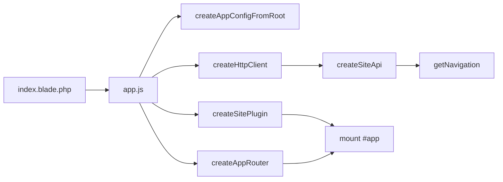

# Vue SPA — архитектура frontend

Документация описывает организацию клиентской части Nexora: **Vue 3 + Vue Router + Vite**. Frontend построен по принципам **SOLID** — слои разделены, зависимости инвертированы через DI.

**Стек:** Vue 3 (Composition API) · Vue Router 4 · Vite · axios  
**Точка входа:** `nexora-app/resources/js/app.js`  
**Сборка:** `npm run build` → `public/build/`

---

## 1. Структура каталогов

```text
nexora-app/resources/js/
├── app.js                          # bootstrap приложения
├── bootstrap.js                    # axios → window.axios
│
├── api/                            # слой данных (DIP)
│   ├── httpClient.js               # обёртка над axios
│   ├── createSiteApi.js            # фабрика API
│   └── modules/
│       ├── pageApi.js              # страницы, навигация
│       ├── projectApi.js           # портфолио
│       └── orderApi.js             # заявки
│
├── config/
│   ├── injectionKeys.js            # Symbol-ключи provide/inject
│   └── appConfig.js                # конфиг из data-атрибутов #app
│
├── services/                       # чистая логика без Vue
│   ├── seo.js                      # document.title, meta description
│   └── navigation.js               # resolve ссылок, active-состояние
│
├── composables/                    # переиспользуемая логика UI
│   ├── useInjections.js            # useAppConfig, useSiteApi, …
│   ├── useAsyncResource.js         # loading / error / data
│   ├── useCmsPage.js               # загрузка CMS-страниц + SEO
│   ├── useOrderForm.js             # форма заявки
│   ├── usePortfolio.js             # портфолио + фильтр тегов
│   └── useSiteNavigation.js        # меню Header
│
├── plugins/
│   └── sitePlugin.js               # provide appConfig, navigation, siteApi
│
├── router/
│   └── index.js                    # маршруты + scrollBehavior
│
└── components/
    ├── App.vue                     # layout: Header + router-view + Footer
    ├── Layouts/
    │   ├── Header.vue
    │   └── Footer.vue
    ├── Page/
    │   ├── IndexPage.vue           # /
    │   ├── PricingPage.vue         # /pricing
    │   ├── ProjectsPage.vue        # /projects
    │   ├── ProjectViewPage.vue     # /projects/page/:id
    │   └── GenericPage.vue         # /:slug
    ├── contact/
    │   └── ContactForm.vue         # форма заявки (главная)
    └── ui/
        └── AsyncState.vue          # loading / error wrapper
```

Стили лендинга — в `resources/css/landing.css`, подключаются через Vite отдельным entry.

---

## 2. SOLID в frontend

| Принцип | Как реализован |
|---------|----------------|
| **S — Single Responsibility** | Каждый модуль отвечает за одну задачу: `pageApi` — только страницы, `seo.js` — только SEO, `ContactForm` — только форма |
| **O — Open/Closed** | Новый endpoint добавляется модулем в `api/modules/` без правок существующих composables |
| **L — Liskov Substitution** | `useCmsPage` единообразно работает для home, pricing, generic и project view |
| **I — Interface Segregation** | API разбит на `pages`, `projects`, `orders` — компоненты используют только нужную часть |
| **D — Dependency Inversion** | Компоненты зависят от `inject(SITE_API_KEY)`, а не от прямого вызова axios |

---

## 3. Запуск и сборка

### Локально (внутри Docker)

```powershell
docker compose exec app npm run dev
```

### Production-сборка

```powershell
docker compose exec app npm run build
```

После сборки assets попадают в `nexora-app/public/build/`. Laravel подключает их через `@vite` в `resources/views/index.blade.php`.

---

## 4. Bootstrap приложения

При загрузке страницы выполняется асинхронный bootstrap:



1. Читается конфиг из `data-*` атрибутов элемента `#app` (`homeUrl`, `csrfToken`, `currentYear` и т.д.).
2. Создаётся HTTP-клиент поверх `window.axios`.
3. Собирается `siteApi` — фасад над доменными API-модулями.
4. Загружается навигация (`GET /api/page/navigation`).
5. Регистрируется `sitePlugin` (provide) и router.
6. Монтируется `App.vue`.

---

## 5. Dependency Injection

Ключи определены в `config/injectionKeys.js`:

| Ключ | Содержимое | Composable |
|------|------------|------------|
| `APP_CONFIG_KEY` | URL, CSRF, favicon, год | `useAppConfig()` |
| `NAVIGATION_KEY` | пункты меню из API | `useNavigationItems()` |
| `SITE_API_KEY` | `{ pages, projects, orders }` | `useSiteApi()` |

Плагин `sitePlugin.js` регистрирует все три зависимости через `app.provide()`.

**Правило:** компоненты не импортируют axios напрямую — только composables и `useSiteApi()`.

---

## 6. API-слой

### httpClient.js

Унифицирует ответы Laravel API:

- `GET` — возвращает `data.data ?? data`
- `POST` — возвращает тело ответа целиком (для `message` в заявках)

### Доменные модули

| Модуль | Методы | Endpoint |
|--------|--------|----------|
| `pageApi` | `getHome()`, `getPricing()`, `getNavigation()`, `getBySlug(slug)` | `/api/page/*` |
| `projectApi` | `getPortfolio(tag?)`, `getById(id)` | `/api/projects`, `/api/projects/{id}` |
| `orderApi` | `submit(payload)` | `POST /api/orders` |

Фабрика `createSiteApi(http)` собирает объект:

```javascript
{
  pages: createPageApi(http),
  projects: createProjectApi(http),
  orders: createOrderApi(http),
}
```

---

## 7. Composables

### useAsyncResource(loader, options)

Базовый composable для асинхронных операций:

- `loading`, `error`, `data`
- `execute()` — запуск загрузки
- опции: `errorMessage`, `notFoundMessage`, `onSuccess`

### useCmsPage(loader, options)

Обёртка над `useAsyncResource` для CMS-страниц:

- автоматически вызывает `applyPageSeo()` при успехе
- `immediate: true` — загрузка в `onMounted`
- `watchSource` — перезагрузка при смене slug/id (GenericPage, ProjectViewPage)

### useOrderForm()

Логика формы заявки на главной:

- валидация через Laravel (422)
- success-состояние с авто-сбросом через 4 секунды
- используется в `ContactForm.vue`

### usePortfolio()

Портфолио: загрузка проектов, фильтрация по тегам, SEO из meta-страницы.

### useSiteNavigation()

Логика Header: мобильное меню, resolve ссылок, active-состояние. Бизнес-правила вынесены в `services/navigation.js`.

---

## 8. Маршруты

| URL | name | Компонент | API |
|-----|------|-----------|-----|
| `/` | `home` | `IndexPage.vue` | `GET /api/page/home` |
| `/pricing` | `pricing` | `PricingPage.vue` | `GET /api/page/pricing` |
| `/projects` | `projects` | `ProjectsPage.vue` | `GET /api/projects` |
| `/projects/page/:id` | `projects.view` | `ProjectViewPage.vue` | `GET /api/projects/{id}` |
| `/:slug` | `page` | `GenericPage.vue` | `GET /api/page/{slug}` |

Маршрут `/:slug` — catch-all для CMS-страниц из Nova. Якорные пункты меню (`#services`, `#team`, `#contact`) ведут на `home` с hash.

`scrollBehavior` — плавный скролл к якорю при переходе с hash.

---

## 9. Компоненты

### App.vue

Корневой layout:

```text
Header (favicon из appConfig)
  router-view  ← страницы
Footer (currentYear из appConfig)
```

### AsyncState.vue

Унифицированный UI для состояний загрузки и ошибки. Слот `#error-actions` — для кнопки «На главную» и т.п.

### ContactForm.vue

Изолированная форма заявки. Вся логика отправки — в `useOrderForm`, компонент только разметка.

### Header.vue

Меню строится из `navigation` (API). Типы пунктов:

| type | Поведение |
|------|-----------|
| `anchor` | `{ name: 'home', hash: '...' }` |
| `external` | внешняя ссылка `<a href>` |
| route | Vue Router по `route_name` / `slug` |

---

## 10. Связь с backend

```mermaid
flowchart TB
    subgraph Vue
        PAGE[IndexPage / PricingPage / GenericPage]
        PRJ[ProjectsPage / ProjectViewPage]
        FORM[ContactForm]
        HDR[Header]
    end

    subgraph Laravel API
        P1[GET /api/page/home]
        P2[GET /api/page/pricing]
        P3[GET /api/page/navigation]
        P4[GET /api/page/{slug}]
        PR[GET /api/projects]
        OR[POST /api/orders]
    end

    PAGE --> P1 & P2 & P4
    HDR --> P3
    PRJ --> PR
    FORM --> OR
```

Контент страниц редактируется в **Laravel Nova** (`Page`, `Project`). Frontend только отображает JSON из API.

---

## 11. Как добавить новую страницу

### Вариант A — CMS-страница (без нового Vue-компонента)

1. Создать запись `Page` в Nova (slug, content, SEO).
2. Добавить пункт меню (`show_in_menu`, `menu_order`, `menu_label`).
3. Страница автоматически доступна по `/{slug}` через `GenericPage.vue`.

### Вариант B — кастомная Vue-страница

1. Создать компонент в `components/Page/`.
2. Добавить маршрут в `router/index.js` **выше** `/:slug`.
3. При необходимости — метод в `pageApi.js` и composable.
4. Добавить catch-all в `routes/web.php` (если новый top-level URL).
5. Пересобрать: `npm run build`.

### Пример: composable для новой CMS-страницы

```javascript
import { useCmsPage } from '../../composables/useCmsPage.js';
import { useSiteApi } from '../../composables/useInjections.js';

const api = useSiteApi();

const { loading, error, page } = useCmsPage(
    () => api.pages.getBySlug('about'),
    { errorMessage: 'Не удалось загрузить страницу «О нас».' },
);
```

---

## 12. Как добавить новый API-модуль

1. Создать `api/modules/fooApi.js`:

```javascript
export function createFooApi(http) {
    return {
        getList: () => http.get('/api/foo'),
    };
}
```

2. Подключить в `createSiteApi.js`:

```javascript
import { createFooApi } from './modules/fooApi.js';

export function createSiteApi(http) {
    return {
        pages: createPageApi(http),
        projects: createProjectApi(http),
        orders: createOrderApi(http),
        foo: createFooApi(http),
    };
}
```

3. Использовать через `useSiteApi().foo.getList()` в composable или компоненте.

---

## 13. Blade shell

SPA монтируется в `resources/views/index.blade.php`:

```html
<div id="app"
     data-home-url="{{ url('/') }}"
     data-projects-url="{{ url('/projects') }}"
     data-favicon-url="{{ asset('favicon.svg') }}"
     data-csrf-token="{{ csrf_token() }}"
     data-current-year="{{ date('Y') }}">
</div>
```

Конфиг читается в `createAppConfigFromRoot()` и передаётся в Header/Footer.

---

## 14. Отладка

| Проблема | Решение |
|----------|---------|
| Белый экран после deploy | `npm run build`, проверить `public/build/manifest.json` |
| 404 на API | `php artisan route:list --path=api` |
| Меню пустое | `GET /api/page/navigation`, проверить seeder / Nova (`show_in_menu`) |
| Форма не отправляется | Network → `POST /api/orders`, CSRF в cookies |
| Старый JS в браузере | Hard refresh (Ctrl+F5) или `npm run build` |

Логи axios — в DevTools → Network. Ошибки bootstrap — в Console.

---

## 15. Связанная документация

| Файл | Содержание |
|------|------------|
| [info.md](./info.md) | Общая архитектура проекта |
| [DB.md](./DB.md) | Схема базы данных |
| [Docker.md](./Docker.md) | Запуск через Docker |
| [Test.md](./Test.md) | Тестирование |
