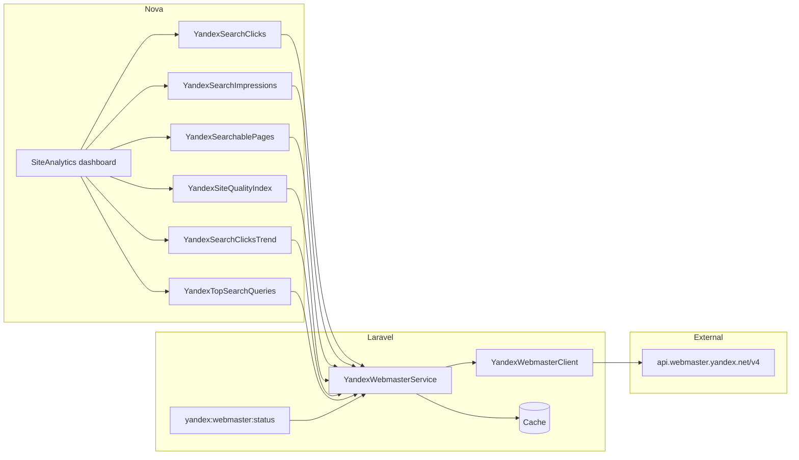
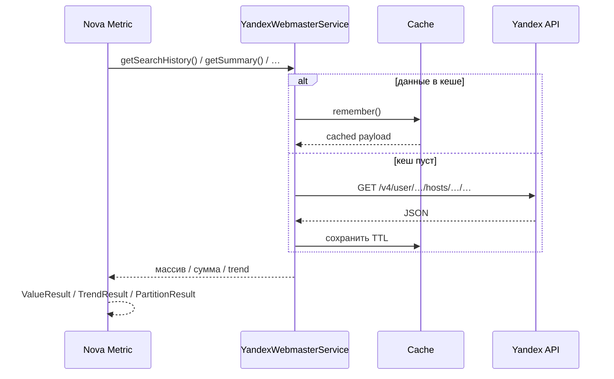

# Яндекс.Вебмастер — аналитика в Nova

Документация описывает интеграцию **API Яндекс.Вебмастера** с админ-панелью **Laravel Nova 5**: дашборд «Посещаемость (Яндекс)» и служебные команды.

**Стек:** Laravel 10 · Nova 5 · HTTP Client (Guzzle) · Cache  
**Источник данных:** [Yandex Webmaster API v4](https://yandex.com/dev/webmaster/doc/en/)  
**URL дашборда:** `/nova/dashboards/site-analytics`

---

## 1. Что показывает дашборд

Интеграция получает **поисковую статистику из Яндекса** — переходы и показы в результатах поиска, индексацию и ИКС. Это **не** полная посещаемость сайта (прямые заходы, соцсети, время на странице). Для полной веб-аналитики нужна отдельная интеграция с **Яндекс.Метрикой**.

| Метрика Nova | API-индикатор / метод | Описание |
|--------------|----------------------|----------|
| **Переходы из Яндекса** | `TOTAL_CLICKS` | Клики из поисковой выдачи за период |
| **Показы в Яндексе** | `TOTAL_SHOWS` | Показы сайта в выдаче за период |
| **Страниц в поиске** | `GET …/summary` → `searchable_pages_count` | Число проиндексированных страниц |
| **ИКС (SQI)** | `GET …/summary` → `sqi` | Индекс качества сайта |
| **Динамика переходов** | `TOTAL_CLICKS` по дням | График кликов |
| **Топ запросов (30 дней)** | `GET …/search-queries/popular` | До 8 запросов с наибольшим числом кликов |

Период для кликов, показов и графика: **7 / 14 / 30 / 90 дней** (переключатель на карточках Nova).

---

## 2. Архитектура



### Поток запроса метрики



---

## 3. Структура файлов

```text
nexora-app/
├── config/
│   └── yandex.php                              # конфиг интеграции
├── app/
│   ├── Exceptions/
│   │   └── YandexWebmasterException.php        # ошибки API (перевод кодов)
│   ├── Services/YandexWebmaster/
│   │   ├── YandexWebmasterClient.php           # HTTP-клиент, OAuth Bearer
│   │   └── YandexWebmasterService.php          # бизнес-логика, кеш, host_id
│   ├── Console/Commands/
│   │   └── YandexWebmasterStatusCommand.php    # php artisan yandex:webmaster:status
│   ├── Nova/
│   │   ├── Dashboards/
│   │   │   └── SiteAnalytics.php               # дашборд «Посещаемость (Яндекс)»
│   │   └── Metrics/
│   │       ├── Concerns/
│   │       │   └── InteractsWithYandexWebmaster.php
│   │       └── YandexWebmaster/
│   │           ├── YandexSearchClicks.php
│   │           ├── YandexSearchImpressions.php
│   │           ├── YandexSearchablePages.php
│   │           ├── YandexSiteQualityIndex.php
│   │           ├── YandexSearchClicksTrend.php
│   │           └── YandexTopSearchQueries.php
│   └── Providers/
│       ├── AppServiceProvider.php              # singleton Client + Service
│       └── NovaServiceProvider.php             # пункт меню + регистрация dashboard
└── tests/Unit/
    └── YandexWebmasterServiceTest.php
```

---

## 4. Конфигурация (.env)

Переменные в `nexora-app/.env` (шаблон — `.env.example`):

```env
YANDEX_WEBMASTER_ENABLED=true
YANDEX_WEBMASTER_OAUTH_TOKEN=ваш_oauth_токен
YANDEX_WEBMASTER_HOST_ID=
YANDEX_WEBMASTER_SITE_URL="${APP_URL}"
YANDEX_WEBMASTER_CACHE_TTL=3600
```

| Переменная | Обязательна | Описание |
|------------|-------------|----------|
| `YANDEX_WEBMASTER_ENABLED` | да | `true` — включить интеграцию |
| `YANDEX_WEBMASTER_OAUTH_TOKEN` | да | OAuth access token пользователя Яндекса |
| `YANDEX_WEBMASTER_HOST_ID` | нет | ID сайта в формате `https:example.com:443`. Если пусто — авто-поиск по `SITE_URL` |
| `YANDEX_WEBMASTER_SITE_URL` | нет | URL для сопоставления с сайтом в Вебмастере (по умолчанию `APP_URL`) |
| `YANDEX_WEBMASTER_CACHE_TTL` | нет | TTL кеша ответов API в секундах (по умолчанию 3600) |

Конфиг Laravel: `config/yandex.php`.

---

## 5. Подключение OAuth

### Предварительные условия

1. Сайт добавлен в [Яндекс.Вебмастер](https://webmaster.yandex.ru/).
2. Права на управление сайтом **подтверждены** (иначе API вернёт `HOST_NOT_VERIFIED`).
3. В Вебмастере уже есть данные по поисковым запросам (иначе возможен `HOST_NOT_LOADED`).

### Получение токена

1. Зарегистрируйте приложение на [oauth.yandex.ru](https://oauth.yandex.ru/).
2. Укажите права доступа к **Яндекс.Вебмастеру** (операции чтения статистики сайта).
3. Пройдите OAuth-авторизацию и получите **access token**.
4. Вставьте токен в `YANDEX_WEBMASTER_OAUTH_TOKEN`.
5. Установите `YANDEX_WEBMASTER_ENABLED=true`.
6. Перезапустите конфиг при необходимости:

```powershell
docker compose exec app php artisan config:clear
```

### Проверка подключения

```powershell
docker compose exec app php artisan yandex:webmaster:status
```

Пример успешного вывода:

```text
Яндекс.Вебмастер
─────────────────
Включено: да
Токен: задан
User ID: 12345678
Host ID: https:nexora.by:443
Сайт: https://nexora.by/
Подтверждён: да

Сводка индексации
ИКС: 120
Страниц в поиске: 15
Исключено: 2

Подключение успешно. Дашборд: Nova → «Посещаемость (Яндекс)».
```

---

## 6. Nova: дашборд и меню

| Параметр | Значение |
|----------|----------|
| Класс | `App\Nova\Dashboards\SiteAnalytics` |
| Название в UI | **Посещаемость (Яндекс)** |
| URI key | `site-analytics` |
| Пункт меню | Nova → боковое меню, иконка `globe-alt` |

Регистрация — в `app/Providers/NovaServiceProvider.php`:

- `dashboards()` — список дашбордов;
- `Nova::mainMenu()` — секция `MenuSection::dashboard(SiteAnalytics::class)`.

### Поведение при отключённой интеграции

Если `YANDEX_WEBMASTER_ENABLED=false` или токен не задан, метрики показывают **0** и суффикс «— API не настроен». Ошибки API логируются в `storage/logs/laravel.log` (уровень `warning`).

---

## 7. Используемые методы API

Базовый URL: `https://api.webmaster.yandex.net/v4`

| Метод сервиса | HTTP | Назначение |
|---------------|------|------------|
| `userId()` | `GET /user` | ID пользователя OAuth |
| `resolveHost()` | `GET /user/{id}/hosts` | Список сайтов, выбор по домену |
| `getSummary()` | `GET /user/{id}/hosts/{host}/summary` | ИКС, страницы в поиске |
| `getSearchHistory($days)` | `GET …/search-queries/all/history` | История кликов и показов |
| `getPopularQueries($days, $limit)` | `GET …/search-queries/popular` | Топ запросов |

Параметры `query_indicator` (`TOTAL_CLICKS`, `TOTAL_SHOWS`) передаются как **повторяющиеся** query-параметры (требование API), это обрабатывается в `YandexWebmasterClient::buildUrl()`.

---

## 8. Кеширование

| Ключ кеша | Данные |
|-----------|--------|
| `yandex.webmaster.user-id` | ID пользователя |
| `yandex.webmaster.host-id` | ID сайта (если не задан в .env) |
| `yandex.webmaster.summary` | Сводка индексации |
| `yandex.webmaster.search-history.{days}` | История кликов/показов |
| `yandex.webmaster.popular-queries.{days}.{limit}` | Популярные запросы |

Дополнительно Nova кеширует результаты метрик через `cacheFor()` (30–60 минут).

Сброс кеша после смены токена или сайта:

```powershell
docker compose exec app php artisan cache:clear
```

---

## 8.1. Коды ошибок API

| Код | Сообщение в админке |
|-----|---------------------|
| `HOST_NOT_VERIFIED` | Права на сайт не подтверждены |
| `HOST_NOT_LOADED` | Данные сайта ещё не загружены в Вебмастер |
| `HOST_NOT_INDEXED` | Сайт ещё не проиндексирован |
| `HOST_NOT_FOUND` | Сайт не найден — укажите `YANDEX_WEBMASTER_HOST_ID` |
| `INVALID_USER_ID` | Неверный OAuth-токен |

Обработка — в `App\Exceptions\YandexWebmasterException`.

---

## 9. Тесты

```powershell
docker compose exec app php artisan test --filter=YandexWebmaster
```

Файл: `tests/Unit/YandexWebmasterServiceTest.php`

Покрывает:

- авто-определение `host_id` по домену;
- суммирование `TOTAL_CLICKS` / `TOTAL_SHOWS`;
- корректную сериализацию повторяющихся `query_indicator`;
- статус при отсутствии токена.

---

## 10. Ограничения и дальнейшее развитие

### Текущие ограничения

- Данные только из **поиска Яндекса**, не все визиты на сайт.
- API Вебмастера требует **OAuth-токен пользователя** (не server-to-server без участия аккаунта).
- Задержка данных со стороны Яндекса — обычно до нескольких дней для свежих сайтов.
- Топ запросов фиксирован на **30 дней** (без переключателя периода на карточке).

### Возможные улучшения

| Задача | Эффект |
|--------|--------|
| Интеграция **Яндекс.Метрики** | Визиты, отказы, глубина просмотра, источники |
| OAuth callback в админке | Получение токена без ручного копирования |
| Карточка «Проблемы сайта» | `site_problems` из `/summary` |
| Экспорт отчёта CSV | Выгрузка топ-запросов |

---

## 11. Быстрый чеклист

```text
☐ Сайт добавлен и подтверждён в webmaster.yandex.ru
☐ OAuth-приложение создано на oauth.yandex.ru
☐ YANDEX_WEBMASTER_ENABLED=true
☐ YANDEX_WEBMASTER_OAUTH_TOKEN задан
☐ YANDEX_WEBMASTER_SITE_URL совпадает с доменом в Вебмастере
☐ php artisan yandex:webmaster:status — успех
☐ Nova → «Посещаемость (Яндекс)» — метрики с данными
```

---

## Связанная документация

| Файл | Содержание |
|------|------------|
| [info.md](./info.md) | Общая архитектура проекта и Nova |
| [Docker.md](./Docker.md) | Запуск контейнеров, artisan-команды |
| [DB.md](./DB.md) | Схема базы данных |
