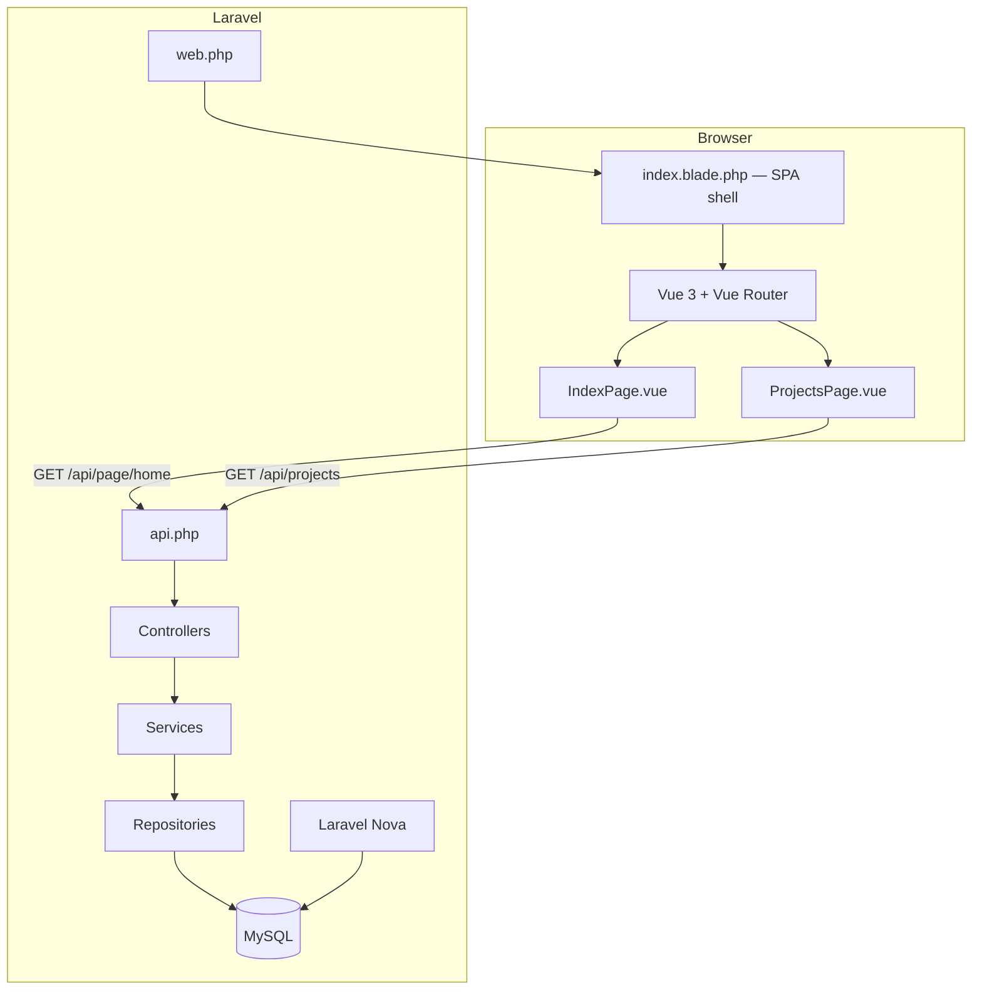
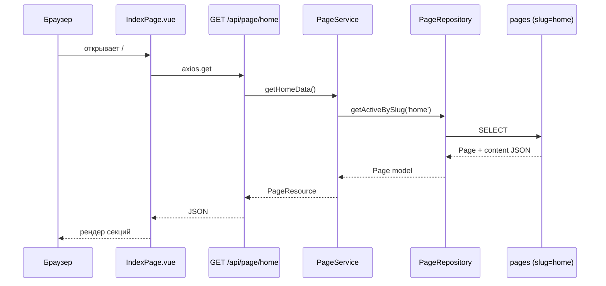
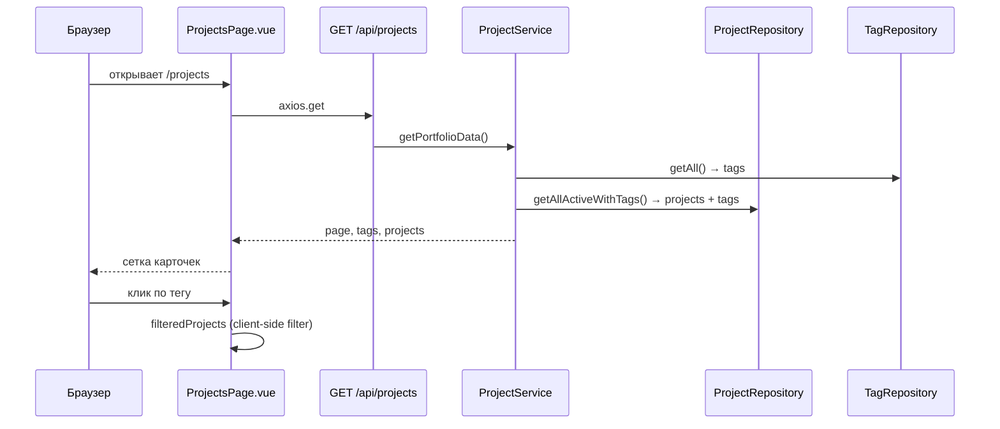

# Nexora — структура проекта и архитектура

Документация описывает текущую организацию репозитория, слои приложения и взаимодействие **Laravel REST API + Vue SPA**.

**Стек:** PHP 8.2 · Laravel 10 · MySQL 8.0 · Vue 3 · Vite · Laravel Nova 5  
**Тип приложения:** сайт-визитка (главная + портфолио) с админ-панелью CMS

---

## Обзор репозитория

```text
nexora2026/
├── docker-compose.yml          # Docker: app, nginx, db, phpmyadmin
├── docker/
│   ├── Dockerfile              # PHP-FPM образ для Laravel
│   └── nginx/default.conf      # конфигурация Nginx
├── Docx/                       # документация проекта
│   ├── info.md                 # этот файл
│   ├── DB.md                   # схема базы данных
│   └── Docker.md               # запуск через Docker
└── nexora-app/                 # Laravel-приложение (корень backend + frontend)
    ├── app/                    # бизнес-логика, API, Nova
    ├── database/               # миграции, сидеры, фабрики
    ├── resources/
    │   ├── js/                 # Vue SPA
    │   ├── css/                # стили лендинга
    │   └── views/              # Blade shell для SPA
    ├── routes/                 # web.php, api.php
    └── public/                 # точка входа, собранные assets
```

---

## Архитектура приложения

Публичная часть построена по схеме **SPA + REST API**. Laravel отдаёт HTML-оболочку и JSON API; Vue отвечает за UI и маршрутизацию на клиенте.



### Слои backend

| Слой | Путь | Назначение |
|------|------|------------|
| **Controller** | `app/Http/Controllers/Backend/` | HTTP-запросы, JSON-ответы |
| **Service** | `app/Services/` | бизнес-логика, сборка данных |
| **Repository** | `app/Repositories/` | доступ к БД через Eloquent |
| **Resource** | `app/Http/Resources/` | формат JSON для API |
| **Model** | `app/Models/` | Eloquent-модели |
| **Nova** | `app/Nova/` | админ-панель CMS |

Привязка интерфейсов репозиториев — в `app/Providers/AppServiceProvider.php`.

---

## Публичные страницы (Vue SPA)

| URL | Vue-компонент | API | Описание |
|-----|---------------|-----|----------|
| `/` | `IndexPage.vue` | `GET /api/page/home` | Главная: описание компании, услуги, кейсы, команда |
| `/projects` | `ProjectsPage.vue` | `GET /api/projects` | Портфолио проектов с фильтром по тегам |

Обе страницы используют один Blade-шаблон `resources/views/index.blade.php` и один entry-point `resources/js/app.js`.

### Структура frontend

```text
resources/js/
├── app.js                      # createApp, router, provide(appConfig)
├── bootstrap.js                # axios (window.axios)
├── router.js                   # маршруты / и /projects
├── api/
│   └── site.js                 # fetchHomePage(), fetchProjectsPortfolio()
└── components/
    ├── App.vue                 # layout: Header + router-view + Footer
    ├── Layouts/
    │   ├── Header.vue          # навигация, мобильное меню
    │   └── Footer.vue
    └── Page/
        ├── IndexPage.vue       # главная (данные из API)
        └── ProjectsPage.vue    # портфолио + фильтр тегов
```

### Конфигурация из Blade

Параметры окружения передаются в Vue через `data-*` атрибуты элемента `#app`:

| Атрибут | Назначение |
|---------|------------|
| `data-home-url` | URL главной |
| `data-projects-url` | URL портфолио |
| `data-favicon-url` | иконка сайта |
| `data-login-url` | ссылка на вход |
| `data-dashboard-url` | ссылка на Nova (`/nova`) |
| `data-is-authenticated` | флаг авторизации |
| `data-csrf-token` | CSRF-токен для форм |
| `data-current-year` | год в footer |

Доступ в компонентах: `inject('appConfig')`.

---

## Маршруты

### Web (`routes/web.php`)

| Метод | URI | Controller | Имя |
|-------|-----|------------|-----|
| GET | `/` | `IndexController` | `home` |
| GET | `/projects` | `IndexController` | `projects` |

Обе записи возвращают view `index` — Vue Router обрабатывает навигацию на клиенте.

### API (`routes/api.php`)

Префикс всех маршрутов: `/api`.

| Метод | URI | Controller | Метод | Описание |
|-------|-----|------------|-------|----------|
| GET | `/page/` | `IndexController` | `indexPage` | список активных страниц |
| GET | `/page/home` | `IndexController` | `showHome` | данные главной страницы |
| GET | `/project/` | `ProjectController` | `indexProject` | список проектов (legacy) |
| GET | `/projects` | `ProjectController` | `portfolio` | портфолио: page + tags + projects |
| GET | `/user` | closure | — | текущий пользователь (Sanctum) |

#### Пример ответа `GET /api/page/home`

```json
{
  "data": {
    "id": 1,
    "slug": "home",
    "title": "Nexora — создание сайтов и веб-разработка",
    "description": "...",
    "content": {
      "hero": { "eyebrow": "...", "title": "...", "lead": "..." },
      "stats": [{ "value": "12+", "label": "..." }],
      "services": [{ "num": "01", "title": "...", "text": "..." }],
      "cases": [{ "tag": "...", "title": "...", "points": [], "result": "..." }],
      "benefits": [],
      "team": [],
      "clients": [],
      "departments": []
    },
    "seo_title": "...",
    "seo_description": "..."
  }
}
```

Поле `content` хранится в БД как JSON (таблица `pages`, slug = `home`). Редактируется через Nova или сидер `PageSeeder`.

#### Пример ответа `GET /api/projects`

```json
{
  "data": {
    "page": {
      "title": "Портфолио — Nexora",
      "description": "...",
      "seo_title": "...",
      "seo_description": "..."
    },
    "tags": [
      { "id": 1, "slug": "crm", "name": "CRM и личные кабинеты" }
    ],
    "projects": [
      {
        "id": 1,
        "slug": "ecotravel",
        "title": "...",
        "type": "Корпоративный сайт",
        "year": 2026,
        "initial": "E",
        "short_description": null,
        "cover_image": null,
        "site_url": null,
        "tags": [{ "id": 3, "slug": "corporate", "name": "..." }]
      }
    ]
  }
}
```

Опциональный query-параметр `?tag=crm` — серверная фильтрация проектов по slug тега.

---

## Backend: ключевые классы

### Controllers

| Класс | Файл |
|-------|------|
| `IndexController` | `app/Http/Controllers/Backend/Page/IndexController.php` |
| `ProjectController` | `app/Http/Controllers/Backend/Project/ProjectController.php` |

### Services

| Класс | Методы |
|-------|--------|
| `PageService` | `getIndexData()`, `getHomeData()` |
| `ProjectService` | `getIndexProjectData()`, `getPortfolioData(?tag)` |

### Repositories

| Интерфейс | Реализация | Методы |
|-----------|------------|--------|
| `PageRepositoryInterface` | `PageRepository` | `getAllActive()`, `getActiveBySlug()` |
| `ProjectRepositoryInterface` | `ProjectRepository` | `getAllActiveProject()`, `getAllActiveWithTags()` |
| `TagRepositoryInterface` | `TagRepository` | `getAll()` |

### API Resources

| Resource | Модель |
|----------|--------|
| `PageResource` | `Page` |
| `ProjectResource` | `Project` (+ eager load `tags`) |
| `TagResource` | `Tags` |

---

## Модели и домены данных

Подробная схема БД — в [DB.md](./DB.md).

| Модель | Таблица | Роль на сайте |
|--------|---------|---------------|
| `Page` | `pages` | контент страниц (главная, портфолио, контакты) |
| `Project` | `projects` | карточки портфолио |
| `Tags` | `tags` | категории для фильтра проектов |
| `Order` | `orders` | заявки с формы (CMS готова, API формы — в планах) |
| `User` | `users` | пользователи Nova |

Связи:

- `Project` ↔ `Tags` — many-to-many через `project_tags`
- `Page` ↔ `Tags` — many-to-many через `page_tags`
- `Project` → `ProjectImage` — one-to-many (галерея проекта)

---

## Laravel Nova (админ-панель)

**URL:** `/nova`

| Nova Resource | Модель | Назначение |
|---------------|--------|------------|
| `Page` | `Page` | редактирование страниц и JSON-контента главной |
| `Project` | `Project` | проекты портфолио |
| `Tags` | `Tags` | теги / категории |
| `ProjectImage` | `ProjectImage` | изображения проектов |
| `Order` | `Order` | заявки |
| `User` | `User` | пользователи |
| `UserRole` | `UserRole` | роли |

---

## Сидеры и начальные данные

| Сидер | Источник данных |
|-------|-----------------|
| `TagsSeeder` | `App\Support\PortfolioData::tags()` |
| `ProjectSeeder` | `App\Support\PortfolioData::projects()` |
| `PageSeeder` | JSON-контент главной страницы |
| `UserSeeder` | пользователь Nova |

`PortfolioData` используется **только в сидерах** для первичного наполнения БД. Runtime-данные идут из репозиториев.

```powershell
docker compose exec app php artisan db:seed
```

---

## Сборка frontend

| Команда | Назначение |
|---------|------------|
| `npm run dev` | Vite dev-server (HMR) |
| `npm run build` | production-сборка в `public/build/` |

Entry points (`vite.config.js`):

- `resources/css/landing.css` — стили лендинга
- `resources/css/app.css` — базовые стили
- `resources/js/app.js` — Vue SPA

Зависимости: `vue`, `vue-router`, `axios`, `@vitejs/plugin-vue`.

---

## Docker и окружение

Полная инструкция — в [Docker.md](./Docker.md).

| Сервис | Контейнер | Порт |
|--------|-----------|------|
| Nginx | `nexora_nginx` | 80 |
| PHP-FPM (Laravel) | `nexora_app` | — |
| MySQL 8.0 | `nexora_db` | 8102 |
| phpMyAdmin | `nexora_phpmyadmin` | 8080 |

**Сайт:** http://localhost/  
**Портфолио:** http://localhost/projects  
**Nova:** http://localhost/nova

---

## Поток данных: главная страница



---

## Поток данных: портфолио и фильтр



Фильтрация по тегам выполняется на клиенте по массиву `project.tags`. Серверная фильтрация доступна через `?tag=slug`.

---

## Устаревшие / резервные файлы

| Файл | Статус |
|------|--------|
| `resources/views/projects.blade.php` | legacy Blade-версия портфолио (заменена Vue) |
| `resources/views/layouts/landing.blade.php` | layout для legacy Blade-страниц |
| `resources/views/backend/page/index.blade.php` | дубликат `index.blade.php` |
| `resources/views/index2.blade.php` | шаблон Laravel по умолчанию |

---

## Связанная документация

| Файл | Содержание |
|------|------------|
| [DB.md](./DB.md) | таблицы, миграции, ER-диаграммы |
| [Docker.md](./Docker.md) | запуск, команды, troubleshooting |
| [Git.md](./Git.md) | работа с Git |
| [GitHub.md](./GitHub.md) | GitHub-репозиторий |

---

## Быстрый старт для разработчика

```powershell
# 1. Запуск Docker
docker compose up -d --build

# 2. Зависимости и ключ
docker compose exec app composer install
docker compose exec app php artisan key:generate

# 3. БД
docker compose exec app php artisan migrate
docker compose exec app php artisan db:seed

# 4. Frontend
docker compose exec app npm install
docker compose exec app npm run build
```

После запуска:

- главная загружает контент из `pages.content` (slug `home`);
- портфолио — проекты и теги из БД;
- контент редактируется в Nova без изменения Vue-кода (структура JSON должна сохраняться).
